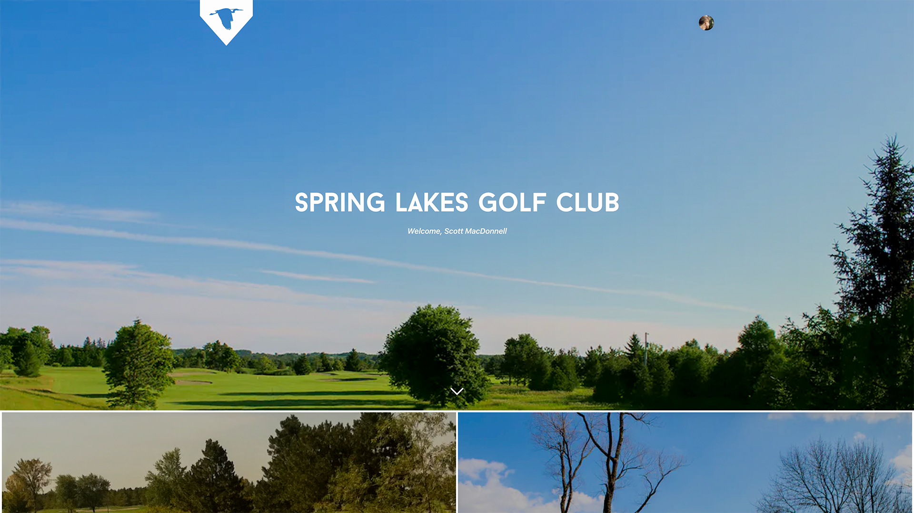

### This project has been sunsetted and archived as of July 1, 2022. Please direct all inquiries to [Spring Lakes Golf Club](https://springlakesgolf.com) in the future.

---

# Spring Lakes Golf Club
> The official website for Spring Lakes Golf Club in Stouffville, Ontario.

[![Next.js Version][next-img]][next-url]
[![GitHub license][license-img]][license-url]

A full-scale client made for club members to conveniently access information about the club, manage memberships, and connect with golf professionals. Built on Next.js, Firebase, Vercel, and Google Cloud Platform.



## Development

This is an example of things you need to use the software and how to install them.

### Prerequisites

It is recommended to install Yarn package manager and the required dependencies for this project which can be done with npm as shown in the example below.

```sh
npm i yarn@latest -g
yarn
```

### Installation

1. Clone the repo
   ```sh
   git clone https://github.com/scottmacdonnell/springlakesgolf.com
   ```

2. Create a .env.local file and add the required keys
   ```sh
   NEXT_PUBLIC_EMAIL_RECIPIANT=""

   NEXT_PUBLIC_FIREBASE_API_KEY=
   NEXT_PUBLIC_FIREBASE_AUTH_DOMAIN=
   NEXT_PUBLIC_FIREBASE_PROJECT_ID=
   NEXT_PUBLIC_FIREBASE_STORAGE_BUCKET=
   NEXT_PUBLIC_FIREBASE_MESSAGING_SENDER_ ID=
   NEXT_PUBLIC_FIREBASE_APP_ID=

   FIREBASE_PRIVATE_KEY=""
   FIREBASE_CLIENT_EMAIL=

   SENDGRID_API_KEY=
   ```

3. Run local development server
   ```sh
   yarn dev
   ```


## Meta

Scott MacDonnell – [@macdonnellscott](https://github.com/scottmacdonnell) – scott@scottmacdonnell.com

Lili Tompkins – [@lilitompkins](https://github.com/lilitompkins) – lilianatompkins@gmail.com

Distributed under the MIT license. See ``LICENSE`` for more information.

[license-img]: https://img.shields.io/github/license/scottmacdonnell/springlakesgolf.com
[license-url]: https://github.com/scottmacdonnell/springlakesgolf.com/blob/main/LICENSE

[next-img]: https://img.shields.io/github/package-json/dependency-version/scottmacdonnell/springlakesgolf.com/next
[next-url]: https://nextjs.org